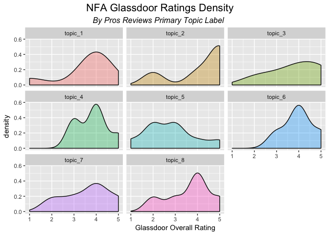

-   [Introduction](#introduction)
-   [Data Collection](#data-collection)
-   [Initial Data Exploration](#initial-data-exploration)
-   [Text Term Extraction](#text-term-extraction)
-   [Reviews Text Data Pre-Processing](#reviews-text-data-pre-processing)
-   [Text Analytics Approach](#text-analytics-approach)
-   [Topic Model Results - Pros Reviews](#topic-model-results---pros-reviews)
-   [Topic Model Results - Cons Reviews](#topic-model-results---cons-reviews)
    -   [*Current Employees*](#current-employees)
-   [Topic Model Results - Cons Reviews](#topic-model-results---cons-reviews-1)
    -   [*Former Employees*](#former-employees)
-   [Limitations of the Analysis](#limitations-of-the-analysis)
-   [Conclusion](#conclusion)

Introduction
------------

My case study focuses on the [Glassdoor employee reviews](https://www.glassdoor.com/Reviews/National-Futures-Association-Reviews-E252718.htm) of my current employer, National Futures Association (NFA). Using these reviews, topic modeling, an increasingly common text analytics approach to learning the pervasive topics from a corpus of documents was explored. The Pros and Cons from each individual review were treated as separate analyses so that topic formation would be grouped by positive topic and negative topic formation to ease the interpretability of the analysis. Learning what topics associate with positive reviews and negative reviews of employees, as provided to a 3rd party reviews website like [www.Glassdoor.com](www.glassdoor.com), may be useful intelligence for HR managers and executives at the company in understanding its *perceived* strengths and weaknesses from an unfiltered employee perspective.

Data Collection
---------------

The data collection strategy required writing a focused web-scraper using the [requests](http://docs.python-requests.org/en/master/) and [BeautifulSoup](https://www.crummy.com/software/BeautifulSoup/bs4/doc/) `Python` libraries in order to systematically download the Pros and Cons reviewer comments. The focus was on obtaining the reviews provided by full-time employees. At the time the data were collected on February 11, 2017, there were 67 reviews that were parsed and downloaded. The data extraction strategy also focused on parsing and collecting other variables about each review (e.g. current vs. former employee, overall rating 1-5, reviewer location), which ended up being helpful in the following analysis. The downloaded reviews data were stored as a data frame in a .CSV file.

Initial Data Exploration
------------------------

The reviews data were uploaded into `R` for initial exploration of the people who are conducting the reviews. We see that the majority of reviews are from current employees (at the time the review was written). Additionally, most reviews are originating from Chicago based employees, although a significant number did not identify their location.

     Chicago New York  Unknown 
          28       18       21 

    Current Employee  Former Employee 
                  42               25 

We can also look at the distribution of overall ratings interval (1-5) from individual reviews. We see, perhaps unsurprisingly that current employees tend to have a higher typical rating of NFA with a median rating of 4, while former employees have a more uniform ratings distribution that is centered around a median of 3. This makes intuitive sense. Former employees tend to leave for a reason, which may be related to a lower satisfaction at the company.

Text Term Extraction
--------------------

Having conducted some initial exploration of some of the variables associated with these individual Glassdoor reviews, initial analysis of the Pros and Cons reviews text for insights commenced. There were 2 separate corpora to work with initially, a Pros Corpus (positive reviews) and a Cons Corpus (negative reviews). These facets of each individual employee review were separated since they are documented in separate sections per each individual review on Glassdoor and this format lends to logic sub-groups on which to learn meaningful topics.

Having set up a corpus for the Pros and the Cons reviews data, a crucial step is to extract important terms and entities from each individual Pro and Con review. To do this, a combination of the [phrasemachine](https://cran.r-project.org/web/packages/phrasemachine/vignettes/getting_started_with_phrasemachine.html) term extraction engine and an n-grams approach for extracting unigram and bigram nouns and noun-phrases was utilized. Sometimes, the phrase extraction engine would return only 1 significant term for a review that was a very short single sentence review. In the case of very short reviews, code was written to alternatively implement a unigrams and bigrams term extraction approach, so that more nouns would be preserved for these shorter reviews to maximize their content and contribution to the models.

As a term extraction example, below is the full text of a recent Pros review, followed by the relevant terms and noun-phrases extracted from this particular review. These terms, also known as tokens, are the inputs for further data pre-processing and eventual analysis.

    [1] "Everyone at NFA is so nice. It is much more relaxed than expected and everyone is willing to help in any way possible. The culture stands out. The benefits are quite amazing as well with the amount of days off, flex days, insurance, and so on. The pay is higher than most places as well."

    [1] "Everyone NFA everyone way culture benefits amount days flex_days days insurance pay places"

Reviews Text Data Pre-Processing
--------------------------------

After extracting terms from the raw text strings of each Pros and Cons review, the [quanteda](http://quanteda.io/articles/quickstart.html) package was heavily used for not only storing the Pros and Cons reviews in separate corpora objects but also to apply a range of text data pre-processing functions. Some of the common pre-processing required for these text data included:

-   convert all terms to lower-case
-   strip out punctuation
-   remove numbers
-   remove alphanumeric symbols
-   strip out remaining stopwords (overly common or uninsightful words such as prepositions, adverbs, "the", "a", "NFA", etc.)
-   stem words to their common root (e.g. salary, salaries, would be stemmed to salari) so these words can be mapped to the same term.
-   develop equivalence classes (e.g. pay, compensation, salary should be mapped to the same single term)
-   drop terms that are infrequent. I used a threshold that a term must have occurred in at least 3 (5%) separate reviews to be included for topic analysis.

After finishing a lot of the data cleaning and pre-processing, the resulting document feature matrix (DFM) for the Pros Review Corpus had dimensions of 63 reviews x 61 key terms, with sparsity (proportion of cells with zero counts) of 47%. This was a huge improvement from an initial DFM before pre-processing of 63 x 519 with sparsity of 97%. The reduction in the size of the matrix and reduction in sparsity is almost entirely due to the development of over 50 equivalence classes, which act as a thesaurus to group like words as the same term. Similar results were noted from the pre-processing work performed on the Cons Corpus. For the earlier sample review noted above, it's post-processed non-zero frequency terms for topic modeling are displayed below.

      COWORKERS day GOOD_BENEFITS PAY FLEX_DAY WORK_CULTURE place
    1         2   2             1   1        1            1     1
      HEALTH_INSURANCE amount
    1                1      1

A sample of what the document feature matrix looks like for the Pros Reviews, which is the input matrix for topic modeling of the Pros reviews is provided below. The matrix is sorted by the most commonly occuring terms and shows the five most common terms and its mapping to specific reviews.

    Document-feature matrix of: 63 documents, 61 features (47.1% sparse).
    (showing first 10 documents and first 5 features)
            features
    docs     WORK_LIFE_BALANCE GOOD_BENEFITS PAY WORKHOURS NICE_COWORKERS
      text1                  4             0   0         0              0
      text2                  0             1   0         0              0
      text3                  2             0   2         0              2
      text4                  0             0   0         0              2
      text6                  4             1   2         2              1
      text7                  0             2   0         0              2
      text8                  0             0   0         0              0
      text9                  0             0   0         0              0
      text10                 2             0   0         0              1
      text11                 4             3   0         3              1

Text Analytics Approach
-----------------------

Topic modeling was the primary text analytics method applied in order to achieve the goals originally laid out in the introduction: understand pervasive positive and negative topics identified in employee reviews. To conduct topic modeling, I used an implementation of **Latent Dirichlet Allocation** (LDA), a topical modeling algorithm that mathematically estimates 2 different parameters at the same time: the combination of popular words generated by each topic (beta estimates), and the probabilistic distribution of those topics over each review (gamma estimates).

Topic Model Results - Pros Reviews
----------------------------------

The final Pros Reviews Topic Model was fit on the document feature matrix for the 63 Pros reviews. The top 10 most frequent terms across all 63 Pros reviews are shown below. Terms in all-caps represent equivalence classes that combine the many different ways that reviewers talked about a similar term or concept.

For the Pros topic model, competing models of topic sizes ranging from as few as 2 topics to over 15 topics were evaluated. Since topic models are an unsupervised method with no target variable being optimized, selecting a best topic model is someone based on interpretability of the results. An 8 topic model was selected as the most easy to interpret. Interpretability was determined based on whether topics had sensical combinations of most common terms associated with each topic. The topic labels provided are my own interpretation of the topic, given the most probable terms generated from that topic (high beta values).

Given these topics, there were a few questions that came to mind worth analyzing. Since in addition to providing term distributions over topics, topic models also provide topic distributions over each review. Each review has a probability score (gamma) across each topic. In other words, the probability distribution from the 8 topics for a single review adds up to 1. We can think of the highest probability topic assigned to each review as the primary topic label for that review. It is the essence of what the review is primarily about. Armed with this information, we can answer the question, "what is the most prevalent Pros review topic across the individual Pros reviews?" Clearly, **topic 8: work-life balance** is the most dominant Pros review topic, followed by **topic 5: Pay** and **topic 6: Hours & Flex Time**.

Additionally, I analyzed how the primary topic of each Pros review related to the reviewer's Overall Rating score for NFA. This may be useful to identify if there are any Pros review topics that are more associated with a particularly high or low overall rating score of the company.

The overall median Glassdoor rating of NFA is a 4. Each Pros review, grouped and plotted by their primary topic, reflects that regardless of the primary topic of the Pros review section, reviewers generally assign a review score centered around 4. The exception appears to be **Topic 5: Pay**, where the density distribution of the 9 reviews where Pay was labeled the main topic seems to center around scores between 2 to 3. The insight here appears to be that if the pay is what you like most about working at NFA (or any company), that may be more indicative of lower overall job satisfaction at NFA (overall rating). This makes sense intuitively. While pay is very important, people's satisfaction with their employer and their career may often be driven by prime factors other than pay.

Topic Model Results - Cons Reviews
----------------------------------

### *Current Employees*

With regards to the Cons Reviews, a divergent approach from the Pros reviews analysis was taken. Since topic formation from multiple passes using all of the Cons reviews led to unconvincing results, the Cons Reviews were split into sub-corpora based on employee status, creating one corpus for Former Employee Cons reviews and another corpus for Current Employee Cons reviews. My hypothesis is that current employees may differentiate on their dislikes about the company from those who decided to leave and there may be distinct topics that arise between the two groups of reviews.

The Cons Current Employee reviews, consisting of 42 reviews, yielded the most interpretable term to topic mappings with a 4 topic model. I have labeled my interpretations of each topic based on the combination of most prevalent words associated with that topic.

For current employees, the most popular primary topic label (where the topic had the largest gamma assigned to that review) was **topic 2: Heavy Workload**.

This is interesting, as the Pros reviews most popular topic was **Work-Life Balance**. This might indicate that work is not evenly distributed across employees, and some perhaps take on more responsibilities than others do.

When we anaylze the primary Cons topic from individual current employee reviews and how the topic relates to their overall rating of NFA, we see that **topic 2: Heavy Workload** has a pretty tight distribution centered around a high score of 4. This may indicate that while heavy workloads may be frustrating, perhaps it's not as much of an impetus for having a poor overall opinion of the company.

Topic Model Results - Cons Reviews
----------------------------------

### *Former Employees*

The Cons Former Employee reviews corpus, consisting of 25 reviews, also yielded the most sensical term to topic mappings with a 4 topic model. I have labeled my interpretations of each topic based on the combination of the most probable terms generated from that topic.

The former employees Cons reviews focus much more on topics surrounding management culture, the executive management at the company, issues surrounding favoritism and promotions, and the audit process. **Topic 4: Audit Process** was the most prevalent primary negative topic discussed by former employees.

When we anaylze the primary Cons topic from individual former employee reviews and how the topic relates to their overall rating of NFA, we see that **topic 2: Promotions and Favoritism** and **topic 3: Senior Management** have overall rating distributions that center around a lower score of 3, relative to the other topics that generally associate with higher overall ratings.

Limitations of the Analysis
---------------------------

There are a few limitations to point about this analysis and the conclusions that may be drawn from them. My analysis relies upon only 67 total reviews, which were not sampled in a way that can reduce the bias of the reviewers posting on Glassdoor. As such, the analysis is not representative, nor claims to be representative of the beliefs of NFA employee experiences. Furthermore, only a handful of reviews are long, while most are short reviews of a couple sentences at most. Working with such small text data in some cases can lead to sub-optimal topic formation. Simply, this means that the topics generated will be weighted much more strongly to reflect the longest positive and negative reviews, respectively, compared to the single-sentence or single phrase positive and negative reviews.

Conclusion
----------

In summarizing the topic formation around positive and negative reviews at NFA reported to Glassdoor, it perhaps comes as little surprise to people familiar with or employed by NFA to see that work-life balance is the most common, positive review topic. It is very much a part of our company culture and a key selling point in our recruiting strategy. In the analysis of negatives, it is also not a surprise to see multiple topics centered around management related concerns. Gripes about management are pervasive at all firms. However, it was interesting to see negative reviews that centered around issues such as heavy workload, audit process and skills development, antiquated policies/practices (corporate card, technology), and perceptions of favoritism in the promotion process. It was also much harder to model the negative reviews topics to achieve easily interpretable topic to most popular term mappings. Familiarity with the individual reviews from spending over a month with these data revealed that everybody seems to have very unique negative experiences and ways of describing those negative experiences, but much more commonality in their positive experiences.

Ultimately, the analysis of the employee reviews of NFA provides an example of one area of text analytics that is possible by using topic modeling methods. When applied to larger datasets of text documents that NFA may collect and store internally (e.g. call center logs), decision makers may be able to access and draw insightful conclusions about patterns in text data collected over time. Such insights can be used to simply better understand the business, help inform strategy, or these insights may be combined with other data sources to perform additional analytical tasks.
